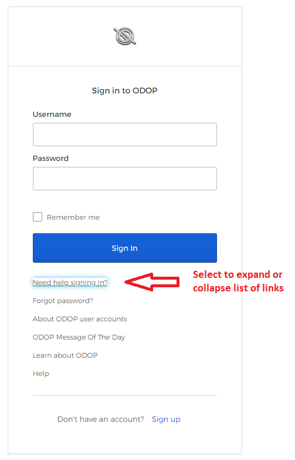

## User Accounts, Username, Login, Logout

A user account with username and password is required to operate the software.   

Evaluators may sign-in with the username "public" and password "public".
It is possible to save designs but keep in mind that all saved information will be completely public.
Designs in the public account are not assured of long-term storage.
At least one week notice will be provided on the [Message of the Day](messageOfTheDay) page 
prior to removing any designs in the public account. 

In order to keep saved designs private and be assured of long-term storage, 
it is necessary to establish a private user account with an associated unique username and password. 
To establish a free private account, 
use the "Sign up" (Self-Service Registration) feature on the sign-in page. 
After you respond to an activation email message, 
your account will be ready for immediate login.

Alternatively, send a request to:   

**Info@SpringDesignSoftware.org**   

You will receive a reply message (welcome letter) with instructions on how to complete creating your account. 
This alternative contains one step that is not automated, 
so expect a delay of hours to a day or so. 
The welcome letter includes instructions on how to establish a password and if desired, 
change it in the future.

The ODOP user account (username / password) feature is based on capabilities provided by 
[Okta](https://www.okta.com/).
Do not expect the ODOP:Spring app to appear on Okta's list of apps and 
do not be concerned about a "You don't have any apps." message on your personal Okta home page
(used for adding apps, changing or recovering passwords, etc.).
Once you have established a password, 
simply [launch the program](../Help/launchODOP) 
in order to get to the sign-in page.

An account username must be in the form of an email address. 
As noted in our [Privacy Notice](Legal/PrivacyStatement), 
your personal information will be secure and not abused. 
If you have any remaining concerns on this point, 
using an email account different than your primary email account is a reasonable approach.

**Screen capture of the sign-in page:**   
    
   
See [Default Designs](../Help/defaultDesigns) for information on how a private design
can be used to personalize system provided default designs.

See [Restrictions](Legal/Restrictions) for long term data storage policies in private accounts.

Follow this link for instructions on how to [change a password](../Help/htt#passwordReset) 
after account creation is complete. 

In order to sign out:
  - use "Logout" on the File menu
  - use the browser refresh button and then click the "Logout" button

The user account feature was intended to have your session expire after a period of inactivity. 
Instead your session expires after a fixed period from app startup regardless of activity. 
In order to continue your session for another eight hours when a design is in-progress, 
you can save it (**File : Save** or **File : SaveAs** menu), 
reload the browser page and 
re-open the saved design.
If the session expires you cannot save the active design, 
but there is an alternative. 
You can print the details of an active design from the browser, 
reload the browser page, log in again and then manually re-enter the details of the design.  
 
 
&nbsp; 
 
When invoked from the ODOP Sign-In, this page opens in a new browser tab.
Switch tabs in order to return to that Sign-In page or simply close this tab.   

&nbsp;   

[About](./)
