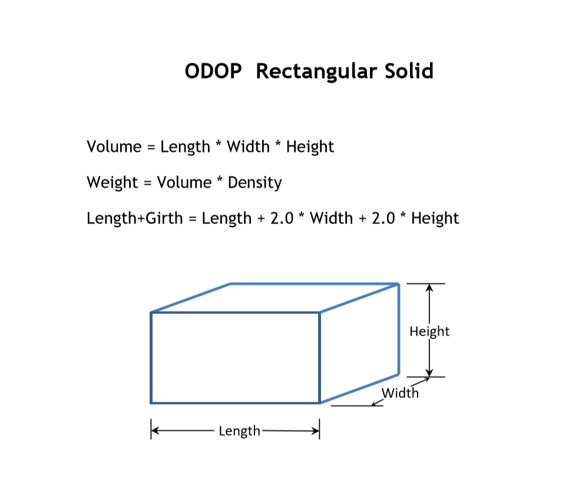

#### Rectangular Solid Design Type

The Rectangular Solid design type is a small demonstration problem.
It is a design situation that most people will be familiar and comfortable with.
This problem will be used as a starting point for introducing concepts and basic program operation.

The Rectangular Solid is a simple box defined by Length, Width and Height.

One interesting feature of the Rectangular Solid implementation is a materials table that 
provides density values for a range of materials (both real and mythical). 
The default starting point supplied with the Rectangular Solid problem includes US Postal Service 
(and much of the shipping industry) constraints on weight (70 pounds) and length + girth
(108 inches). 
Thus, the user can experiment with various materials to see what will fit within USPS regulations.

[Design Types](./)   
[Help](../)   
