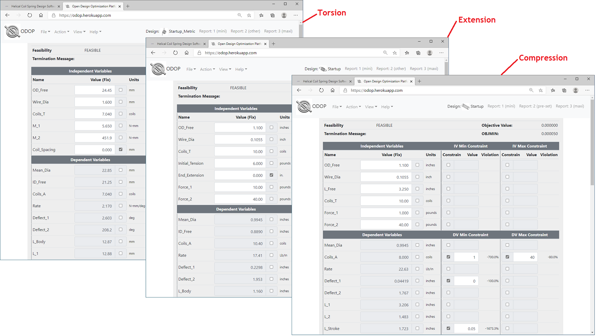
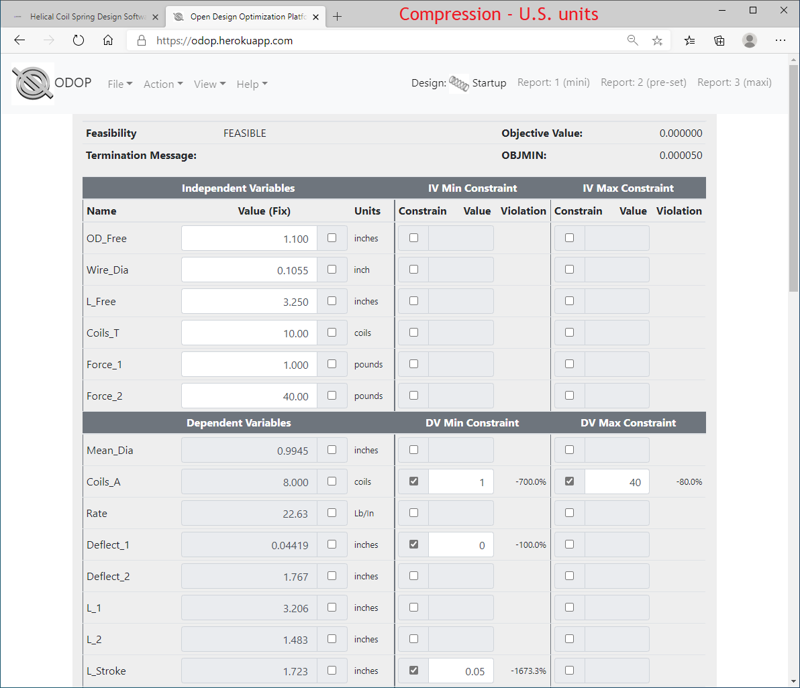
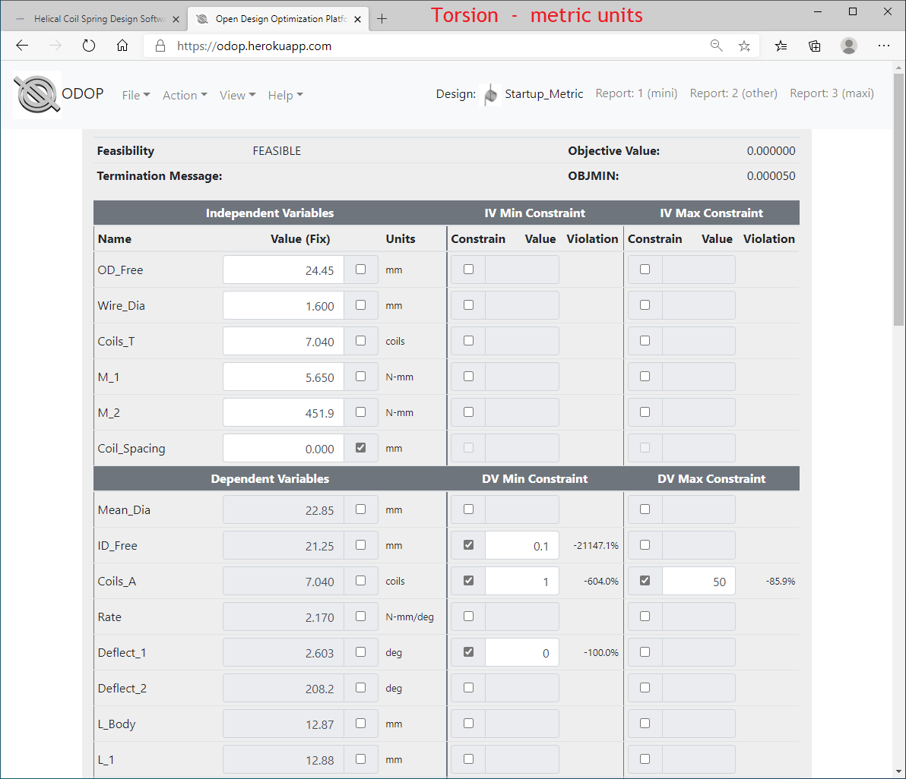
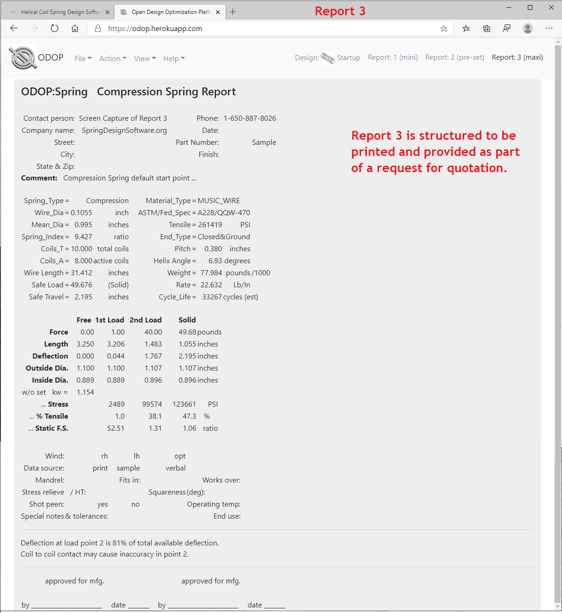
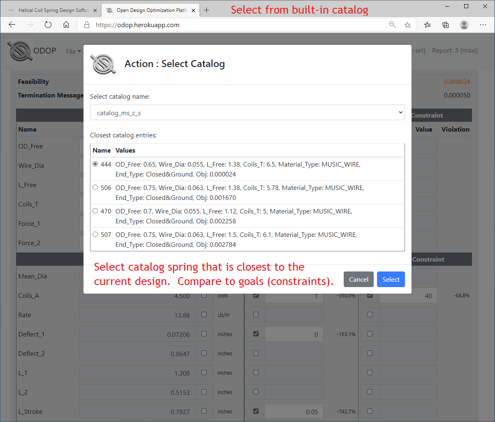
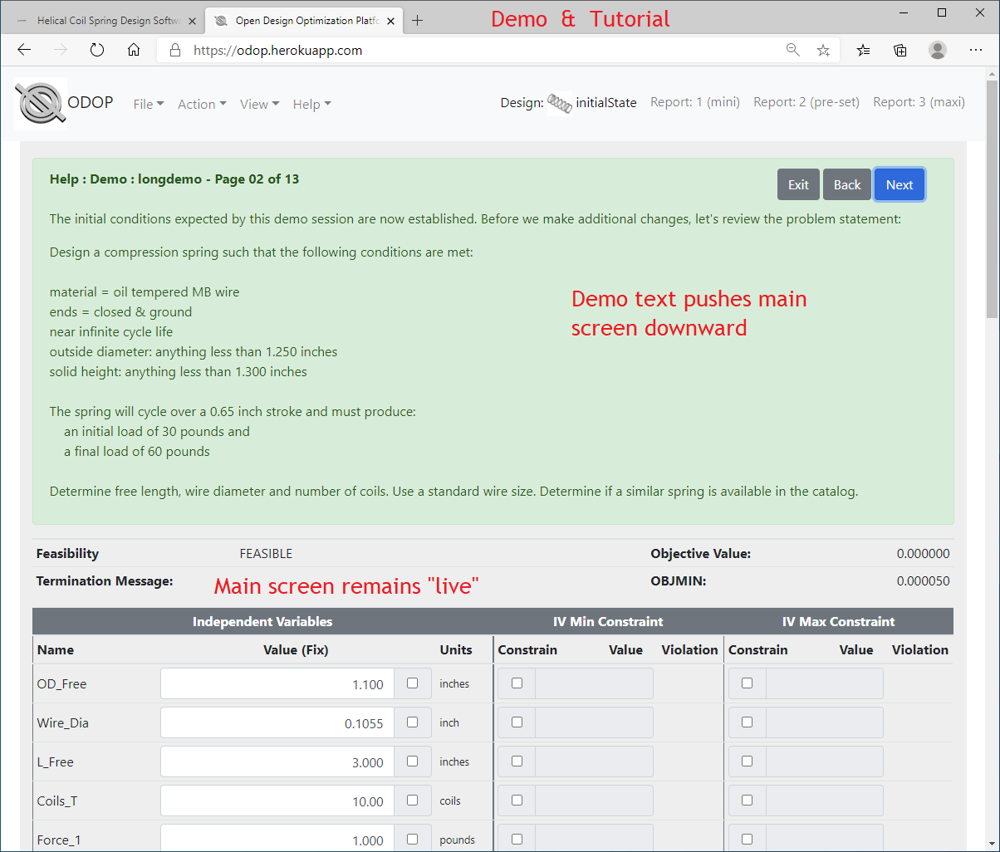

#### ODOP:Spring Screen Shots

Click each thumbnail image for a full-size screen shot of the ODOP:Spring web app. 
Use your browser's **Back** button to return to this page.  
&nbsp;   

The main page of the ODOP:Spring user interface. &nbsp; 
  

Compression spring; U.S. customary units (inches, pounds). &nbsp; 
  

Extension spring; U.S. customary units (inches, pounds). &nbsp; 
  

Torsion spring; metric units (mm, Newtons). &nbsp; 
 

Reports summarize results in a spring-type specific format. &nbsp; 
 

Report 3 is intended to support a request for quotation. &nbsp; 
 

Select the nearest from a catalog of stock springs. &nbsp; 
 

Solutions to commonly available handbook problems are available. &nbsp; 
 

  
&nbsp;   
    
[Help](../)

