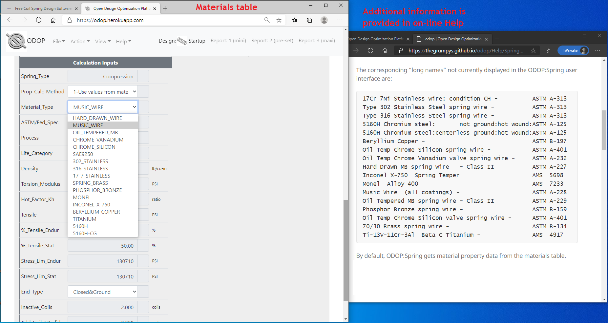
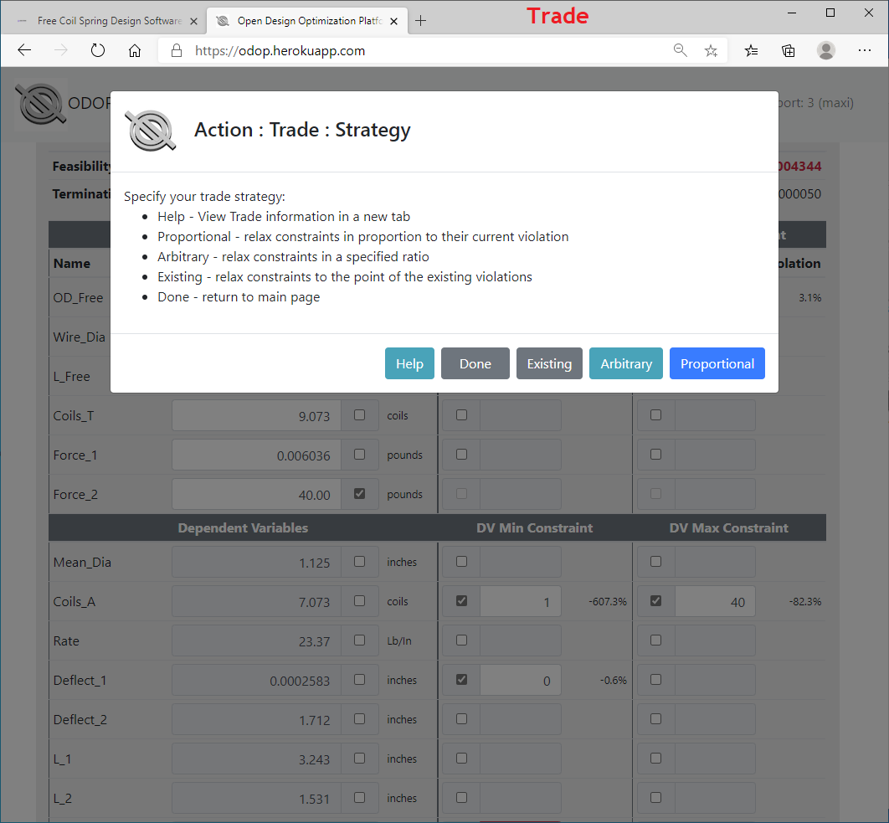

#### ODOP:Spring Screen Shots

Click a thumbnail image or the link within a description field to see a full-size screen shot of the ODOP:Spring web app. 
Use your browser's Back button to return to this page.  
&nbsp;   

Thumbnail | &nbsp; | Description
--- | --- | ---
 | &nbsp; | The main page of the ODOP:Spring user interface. [Compression, Extension & Torsion](../png/ScrCap_3TypeNoted.png "Compression, Extension & Torsion")
 | &nbsp; | [Compression spring](../png/ScrCap_CompressionNoted.png "Compression spring main page"); U.S. customary units (inches, pounds).
 | &nbsp; | [Extension spring](../png/ScrCap_ExtensionNoted.png "Extension spring main page"); U.S. customary units (inches, pounds).
 | &nbsp; | [Torsion spring](../png/ScrCap_TorsionMetricNoted.png "Torsion spring; metric units"); metric units (mm, Newtons).
 | &nbsp; | A built-in table of [material properties](../png/ScrCap_MaterialsNoted.png "Materials table") is provided.
 | &nbsp; | Use the [Select Size](../png/ScrCap_SelectSizeNoted.png "Select Size feature") feature to choose a standard wire size from a built-in table. Each material has its own table of standard sizes.
 | &nbsp; | [Reports](../png/ScrCap_Report1Noted.png "Report 1") summarize results in a spring-type specific format.
 | &nbsp; | [Report 3](../png/ScrCap_Report3Noted.png "Report 3") is formatted to support a request for quotation.
 | &nbsp; | Use the [Select Catalog](../png/ScrCap_SelectCatalogNoted.png "Select Catalog feature") feature to choose the nearest entry from a built-in catalog of stock springs.
 | &nbsp; | The [Demo](../png/ScrCap_DemoScreenNoted.png "Example of a Demo page") feature provides solutions to several commonly available handbook problems.
 | &nbsp; | [Seek](../png/ScrCap_SeekNoted.png "Seek feature") does optimization.  It can find the constrained extreme of any problem variable.
 | &nbsp; | When faced with conflicting objectives, [Trade](../png/ScrCap_TradeNoted.png "Trade feature") provides guidance in relaxing constraints to find the design closest to the original objectives.

  
&nbsp;   
    
[Help](../)

