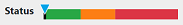
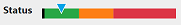

## Feasibility Indicator

ODOP has a multi-colored Feasibility Status Indicator that provides feedback on the 
viability of the current design relative to constraints and FIXes. 
The indicator provides at-a-glance interpretation of the [Objective Value](terminology#obj).
 
 Graphic | Description | Obj Value
 --- | --- | ---  
  | STRICTLY FEASIBLE | zero    
  | FEASIBLE | < OBJMIN  
  | CLOSE TO FEASIBLE | < 4x OBJMIN  
  | NOT FEASIBLE | > 4x OBJMIN  
 
 The tool tip on the label "Status" provides additional insights: 
 

 
 The value of OBJMIN may be adjusted on the <b>File : Preferences</b> menu.
 Also, OBJMIN is one of the values set by the tweakPrefs script that is reached from the <b>Action : Execute</b> menu.
 
 Use the Search feature (<b>Action : Search</b> menu) to obtain the lowest value of the Objective Value 
 consistent with the FIXes and constraints imposed on the problem.
 
 