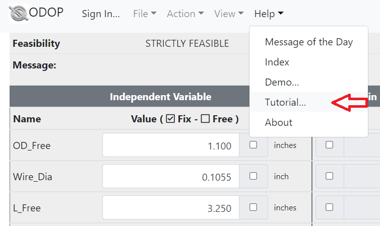
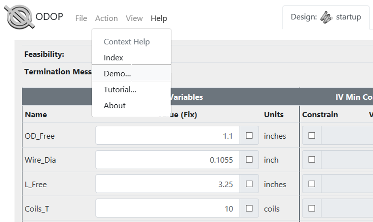
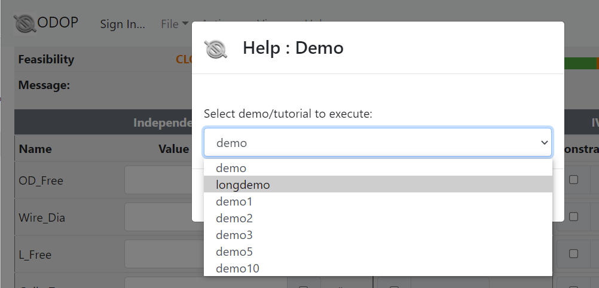

#### Getting Started With the Spring Tutorial and Demo

This page describes how to launch the first sessions of the spring design 
Tutorial and the spring design Demo.
Also, a few suggestions on how to explore ODOP:Spring after completing the
tutorial and demo sessions are provided.   

Tutorial sessions teach operation of the program.
Use the <b>Help : Tutorial...</b> menu item to select the desired tutorial session.   

   

&nbsp;

   

&nbsp;

Demo sessions illustrate problem solving techniques as well as provide
sample solutions to several generally available reference book problems.
Use the <b>Help : Demo...</b> menu item to select the desired demo session.   

   

&nbsp;

   

&nbsp;

**Spring Design Process**   
After completing tutorial and demo sessions,
a bit of free-form experimentation may be in order.
The remainder of this discussion will provide a few 
suggestions on how to explore the program.

Start from an existing design.   

CHANGE independent variables.
For the compression spring design type, those include
  Wire\_Dia, OD\_Free, Coils\_T, L\_Free, Force\_1, or Force\_2.
 Observe that recalculations happen immediately.
 
&nbsp;

 Look at reports contained in the three Report tabs.   
    
 
&nbsp;

 After introducing enough changes to violate a few constraints,
 run a Search (Action : Search menu) to see if it can find a "feasible" 
 solution that  does not violate any constraints. 
 Establish or change the value of constraint levels; 
 for example,  OD\_Free MAX, L\_Stroke MIN and/or L\_Solid MAX. 
 Repeat the  search and observe how the design is adjusted to accommodate 
 your objectives. 
 To observe how ODOP:Spring reacts to a request to achieve the impossible, 
 increase Force\_2 MIN until Search can no longer find a feasible solution. 
 Move a different constraint, perhaps OD\_Free MAX or another
 constraint that shows up as violated, until Search finds a feasible
 solution again.
 
 Use the FIX capability on one or more dependent variables like 
 RATE, L\_1 or L\_2. 
 Remember that a Search must be performed to establish the desired
 values when you FIX a dependent variable.

 Finally, try to design a spring from scratch. 
 Use the main page entry fields to enter constraints
 associated with a hypothesized design. 
 Try designing the spring in a ball  point pen, 
 or perhaps a suspension spring for an automobile or a diesel locomotive. 
 Use the File : SAVE menu item to save the results of your work in 
 the design library.
 
 SEEK and TRADE are covered in later sections of the tutorial.
 You can master these advanced features with the same technique. 
 Dive in and try it! 
 
 Once you have already saved any work that you wish to keep, 
 you can exit the program by simply closing the browser tab.

 
[Help](./)

 