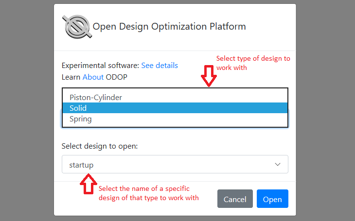

## Launching the Program   

As noted in the [requirements](../About/requirements) page, 
it is not necessary to load any software on your computer in order to run the 
ODOP software. 
Only a recent web browser is necessary.

While it is possible to use the ODOP software from a mobile device,
establishing initial impressions with a full-size monitor, keyboard and mouse
is recommended.   

Where a wide-screen monitor is in use, 
it should be possible to view both the program and on-line Help entries 
simultaneously in separate, non-overlapping windows.
See: [Utilizing on-line Help with a widescreen monitor](wideScreen) for additional details. 
If a wide-screen monitor is not available, 
you can operate with this Help content in one
browser tab while the ODOP main page is in another browser tab.
This approach will permit rapid switching from this Help content in order
to view the corresponding part of the program user interface. 
For example, the ODOP main page.   

In order to start the ODOP software in **this browser window** (or tab), 
follow this link:   

[Launch ODOP](https://odop.herokuapp.com)   
  
&nbsp;   

Alternatively, copy this address (URL):   

**https://odop.herokuapp.com**

and paste it into the address field of a different browser window (or tab).   
  
Depending on current web hosting provisions, 
there may be a delay of approximately 20 seconds the first time that the software is launched
within any specific 30 minute period. 
If you are not currently signed in, a sign-in screen will appear. 
A user account with associated username and password 
is required to access the ODOP:Spring software.
See: [User Accounts](..\About\userAccounts) for details on
how to obtain an account.   

**Screen capture of the sign-in page:**   
  
  
&nbsp;

Once logged in, you will reach a screen where it is possible to select 
a design type and a starting design.   

  
&nbsp;

After opening a specific design, you will reach ODOP's main page.
This screen capture illustrates the default (Startup) design of the Rectangular Solid design type.   

  
&nbsp;

To continue, use your browser's **Back** button to return to the previous page now.

&nbsp;

[Help](./)
