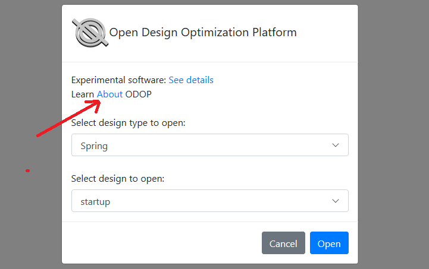

## Launching the program   

While it is possible to use the ODOP software from a mobile device,
establishing initial impressions with a full size monitor, keyboard and mouse
is recommended.   

In the best of all configuration possibilities, where a wide screen monitor is in use, 
it should be possible to configure two independent browser sessions in a 
side-by-side configuration.
Note that this is different than two tabs in one browser session.
Put this Help content in one browser window such that it
takes up roughly one third of the screen width.
Put the ODOP main page in a separate browser window such that it takes up 
the remaining two thirds of the screen width.
It will then be possible to see both the screen captures in the Getting Started 
discussion and the referenced program features on the main page at the same time.

Alternatively, if a wide screen monitor is not available, 
you can operate with this Help content in one
browser tab while the ODOP main page is in another browser tab.
This approach will permit rapid switching from this Help content in order
to view the corresponding part of the program user interface.

In order to start the ODOP software, 
copy this address (URL):   

**https://odop.herokuapp.com**

and paste it into the address field of your browser.   
 
If you are using the side-by-side  browser configuration, paste the URL into 
the address line of each browser.
In each browser, follow the link to bring up the ODOP starting dialog.
In the smaller window, click the "About" link.   

&nbsp;

That "About" link will take you to the Introduction page and from there you can 
procede to the Getting Started page and continue with these instructions while 
viewing ODOP program operation in the larger window.

Use your browser's Back button to return to that discussion now.

