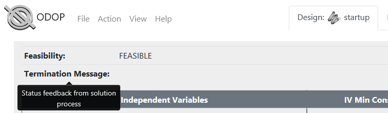

#### ODOP Menus

This topic covers the ODOP menu structure. 
Additional content will be developed as time and priority permits. 

<!--- When there is real content here, don't forget to include it in the appropriate index.md files.  -->

**On this page:**  
[ODOP logo](menus#ODOPlogo)  
[Sign In...](menus#SignIn)  
[File : Open...](menus#FileOpen)  
[File : Save](menus#FileSave)  
[File : Save As...](menus#FileSaveAs)  
[File : Delete...](menus#FileDelete)  
[File : Import...](menus#FileImport)  
[File : Export](menus#FileExport)  
[Action : Search](menus#ActionSearch)  
[Action : Seek...](menus#ActionSeek)  
[Action : Trade...](menus#ActionTrade)  
[Action : Select Size...](menus#ActionSelectSize)  
[Action : Select Catalog...](menus#ActionSelectCatalog)  
[Action : Execute...](menus#ActionExecute)  
[View : Advanced](menus#ViewAdvanced)  
[View : Calculator](menus#ViewCalculator)  
[View : Reports](menus#ViewReports)  
[Help : Index](menus#HelpIndex)  
[Help : Demo...](menus#HelpDemo)  
[Help : Tutorial...](menus#HelpTutorial)  
[Help : About](menus#HelpAbout)  

___

  
___

**ODOP logo**  

The ODOP logo at the far left of the menu bar resets the app. 
Specifically, the reset operation causes a reload of the app home page.

After reset, if AutoSave data for an in-progress design is available, that data will be reloaded. 
Once reloaded, AutoSave data is cleared.
In most cases the first reset will return the design to the state prior to the most recent
Search, Seek, Trade, Select Size or Select Catalog operation. 
A second reset removes all in-memory aspects of the previous design and 
returns to the default design type and Startup design.

Considering that it is possible for a reset to cause a loss of work in progress,
it is good practice to save your work (**File : Save** or **File : Export**) 
before invoking a reset of the app.  

See also:   
[AutoSave](autoSave)   

___

  
___

**Sign In...**  

The Sign In button appears on the menu bar between the ODOP logo and the File menu.
Use the Sign In button to create a new user account or log into an existing account.  

See also:   
[User Accounts](../About/userAccounts)   

___

  
___

**File : Open...**  

The File : Open... menu item produces a dialog box that allows the selection of design type 
(for example, compression, extension and torsion springs) and 
a specific starting design. 
The selected design comes from the cloud-based ODOP Design Library and replaces the current design.
This starting design may be system provided or a private design saved in a user account.
System provided designs are marked "[ReadOnly]".

The dialog also offers a Sign In opportunity to create a new user account 
or to log into an existing account.

The units system, for example, US Customary units (inches, pounds) 
or metric units (mm, newtons) is established by the selected starting design.

See also:   
[Default Designs](defaultDesigns)   
[User Accounts](../About/userAccounts)   
[Units: US customary and metric](SpringDesign/unitsUSmetric)  
[Import and Export](htt#fileImportAndExport)  
[ODOP Design Library](terminology#designLib)

___

  
___

**File : Save**  

The File : Save menu item updates the current design into the cloud-based ODOP Design Library. 
It is necessary to be logged into a user account.
If not logged in to a user account, a pop-up providing a Sign In opportunity will appear.

See also:   
[Default Designs](defaultDesigns)   
[User Accounts](../About/userAccounts)   

___

  
___

**File : Save As...**  

The File : Save As... menu item saves the current design into the cloud-based ODOP Design Library with a new name. 
It is necessary to be logged into a user account. 
If not logged in to a user account, a pop-up providing a Sign In opportunity will appear.

See also:   
[Default Designs](defaultDesigns)   
[User Accounts](../About/userAccounts)   

___

  
___

**File : Delete...**  

The File : Delete... menu item removes the selected design. 
It is necessary to be logged into a user account. 
If not logged in to a user account, a pop-up providing a Sign In opportunity will appear.   

After deleting a design with the same name as a system supplied design,
the system supplied design is revealed. 
System provided designs are marked "[ReadOnly]".

There is no un-delete feature.

See also:   
[Default Designs](defaultDesigns)   
[User Accounts](../About/userAccounts)   

___

  
___

**File : Import...**  

The File : Import menu item restores a previously exported design as the current design.   

See also:   
[Import and Export](htt#fileImportAndExport)  

___

  
___

**File : Export**  

The File : Export menu item saves the current design as a download into a file in the local file system. 
By default, the file is placed in the user's download folder (directory) with a file name extension of ".json". 
Use browser settings to control the default download folder or be prompted to specify a folder every time.   

See also:   
[Import and Export](htt#fileImportAndExport)  

___

  
___

**Action : Search**  

The Action : Search menu item invokes the numerical search algorithm to provide ODOP's back-solving capability. 
The Search feature gives a flexible approach to invert the dependent-independent relationships of the design equations. 
Search will alter the values of any FREE independent variables to find 
a "feasible" design that satisfies constraints and FIXes. 

Specifically, 
FIXed status causes Search to achieve or hold a specified value. 
FREE status allows Search to manipulate that variable to achieve a feasible design. 

Search operates to minimize the value of the [objective function](terminology#obj). 
The current design is used as a starting point. 
Search stops if the Objective Value falls below OBJMIN.  

Results of a Search are reported in the Result Section that appears 
at the upper portion of the main page (Advanced and Calculator views).   

  

The tooltip associated with the "Status" label of multi-color Feasibility Indicator provides 
the numeric values of the current Objective Value and OBJMIN. 

See also:   
[Search](search)   
[Feasibility](feasibility)   
[Feasible Region](terminology#feasibleRegion)  
[Design Situations](designSituations)

___

  
___

**Action : Seek...**  

The Action : Search menu item provides ODOP's goal seeking capability.
The Seek feature can obtain the constrained extreme of any variable, independent or dependent.

For example in spring design, Seek can be asked to find the lightest material weight (or lowest spring rate, least solid height, greatest factor of safety, etc.) while maintaining  specified objectives for force and deflection, stress, diameters, etc.   

Seek will prompt for the name of the varible to be investigated and the direction (Max or Min) to move in.

Results of a Seek are reported in the Result Section that appears 
at the upper portion of the main page (Advanced and Calculator views).   

  

See also:   
[Seek](seek)   
[Feasibility](feasibility)   
[Feasible Region](terminology#feasibleRegion)  
[Design Situations](designSituations)

___

  
___

**Action : Trade...**  

The Action : Trade menu item provides a feature to guide the restructuring of goals 
associated with an infeasible design in a way that is most consistent with original objectives. 

For example in spring design, 
if all of the original design objectives cannot be achieved concurrently,
 one or more (ex. spring cycle life) may be slightly compromised 
in order to maintain the others (ex. loads, deflections, outside diameter and solid height).  

Trade prompts the user step-by-step through a process that starts with a list of violated constraints.
The user designates the constraints eligible to be relaxed and in what proportions. 
After allowing the user to provide an exploration step size, 
Trade extrapolates to the "nearest" feasible design in the designated direction and offers the user 
the opportunity to accept that set of constraints. 

See also:   
[Trade](trade)   
[Feasibility](feasibility)   
[Feasible Region](terminology#feasibleRegion)  
[Design Situations](designSituations)

___

  
___

**Action : Select Size...**  

 The Action : Select Size menu item searches a table for standard sizes nearest
 to the current value of the designated Independent Variable.

 If the user selects a standard size from the table, that value will be
 established for the selected Independent Variable, which is then put in
 "FIXed" status.  The user should then execute a Search to obtain
 corresponding values for the other Independent Variables.
  
 In spring design Calculator view, selecting a new value of Wire_Dia automatically
 incorporates selection from the appropriate (US, metric) standard size table and
 automatically puts the selected value in FIXed status. 

See also:   
[Select Size](SpringDesign/selectSizeCatalog)   

___

  
___

**Action : Select Catalog...**  
Content describing Action : Select Catalog goes here  

___

  
___

**Action : Execute...**  
Content describing Action : Execute goes here  

___

  
___

**View : Advanced**  
 
Advanced View is a design type independent display of all input and output variables.
It provides access to all program features.

Use the checkboxes in the variables column to control FIX / FREE status.
Use the constraints column to establish or modify Min and/or Max values of constraints on the corresponding variables.

[Spring variables displayed in Advanced View](https://www.springdesignsoftware.org/odop/docs/Help/png/ScrCap_3TypeNoted.png)

___

  
___

**View : Calculator**  

Calculator View, available for spring design types, 
provides a simplified display of major input and output variables in a compact format specific to spring design. 
 
Right click (long press on a touch screen) on one of the white entry fields or a darker (more bold) 
numeric value to control FIX / FREE status and to establish or modify constraints on those variables. 
For now, Firefox users need to use Advanced View in order to access FIX / FREE and constraints. 

Enabled constraints are indicated by a fine border line at the edge of a numeric field.
A border on the left indicates that a lower (Min) constraint is enabled.
A border on the right indicates that an upper (Max) constraint is enabled.
A heavier border on both left and right of a numeric field indicates FIXed status.
No border line indicates FREE status and no constraint enabled.

[Spring variables displayed in Calculator View](https://www.springdesignsoftware.org/odop/docs/Help/png/ScrCap_3TypeCalcNoted.png)

___

  
___

**View : Reports**  
Content describing Reports goes here  

___

  
___

**Help : Index**  
Content describing on-line Help goes here  

___

  
___

**Help : Demo...**  
Content describing Help Demo goes here  

___

  
___

**Help : Tutorial**  
Content describing Help Tutorial goes here  

___

  
___

**Help : About**  
Content describing Help About goes here  

1  

2  

3  

4  

5  

6  

7  

8  

9  

10  

___

&nbsp;
 
[Help](./)

