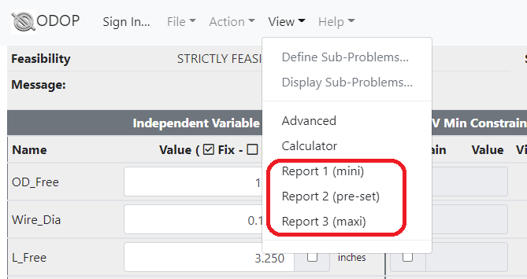

#### Reports

ODOP has the capability to present "report tabs" contained within 
ODOP's browser window.
These report tabs are specific to each design type and 
provide problem specific information in a format that is more 
flexible than the grid of the ODOP main page.
The Piston-Cylinder and Rectangular Solid design types do not
provide any report tabs.
The Spring design types each provide three report tabs.

    

&nbsp;

The reports should be thought of as just another "view" of
the same information. 
Any change made on the main page will immediately be reflected
in each of the reports.

Depending on the capabilities of the user's web browser,
it should be possible to print the individual report pages or save 
into .PDF format.
Refer to the documentation on the browser's print function for
additional information.

