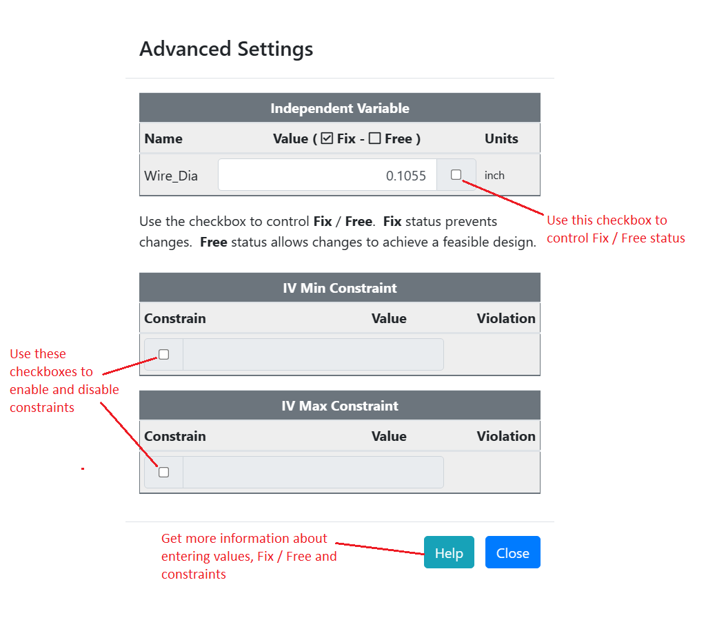

### Setting Values   

This entry covers the input of values into ODOP. 
Additional information on the operation of [Fix, Free](terminology#fix) and [constraints](terminology#constraints) is provided.   

**Views**

The ODOP View menu provides access to various "Views".  
Each view is just a different way of looking at the current state of the [mathematical model](terminology#mathModel). 
All ODOP [design types](terminology#designTypes) provide an "Advanced View" that permits input of values and provides access to all features.
The ODOP spring design types also provide output-only "reports" and 
a simplified spring design specific "Calculator View" that accepts inputs.

User inputs to Advanced View And Calculator View operate similiarly.   

**Input Operations Common to Both Advanced View and Calculator View**

New values may be supplied by clicking on the desired value and directly over-writing the existing value. 
The existing value may be edited. 
Double-click (double-tap a touch screen) to replace the entire value.  

Use the checkbox immediately right of the variable value to control [Fix / Free](terminology#fix) status. 
Use the checkbox immediately left of constraint levels to enable or disable [constraints](terminology#constraints). 
See the annotated screen capture below. 

_[Independent Variables](terminology#independentVar)_

Free status allows [Search](terminology#search) to change this variable to achieve a feasible design. 
Fix status prevents Search from changing the specified value for this variable.

_[Dependent Variables](terminology#dependentVar)_

Fix status causes Search to to achieve the specified value for this variable if possible.
Otherwise, a compromise is achieved.

_[Constraints](terminology#constraints)_

If possible, Search will maintain a value greater than the minimum.
Otherwise, a compromise is achieved.

If possible, Search will maintain a value less than the maximum.
Otherwise, a compromise is achieved.   

**Operations specific to Calculator View**  

Calculator View provides access to Fix / Free and constraints in a pop-up value input dialog box. 
Use right-click (long press on a touch screen) on the variable of interest to access this value input dialog box. 
With Calculator View, values with a darker, more bold font may be changed by the user.
Values with a dim or less bold font are calculated results and cannot be directly changed.

   

&nbsp;

Notes:   
 - Do not leave a value field blank.  See also: [Not a Number](htt#nan)
 - &nbsp;
 